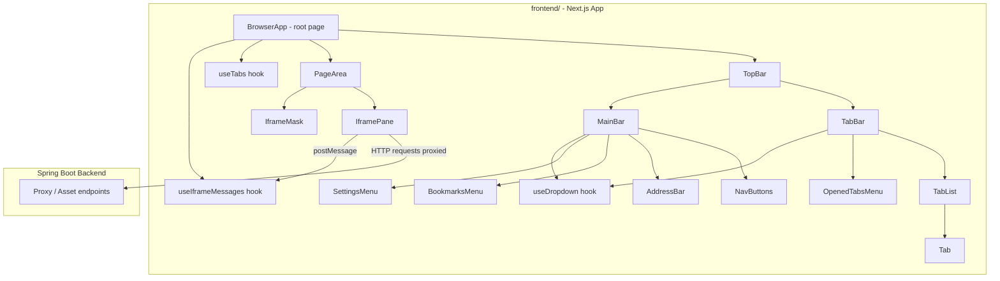
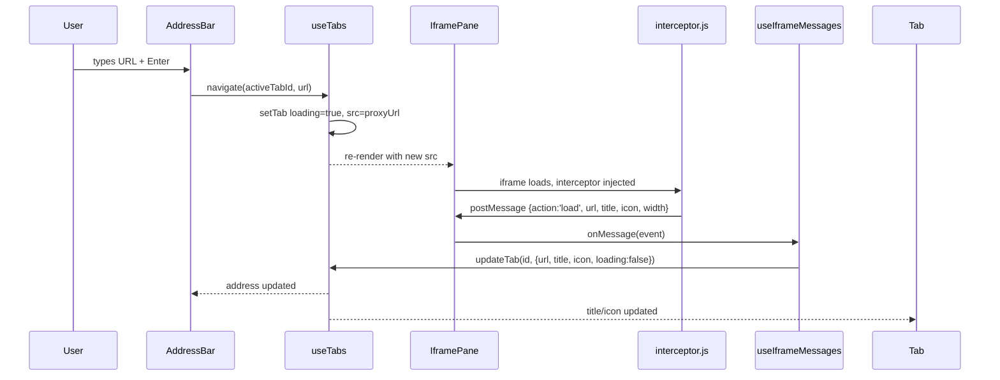
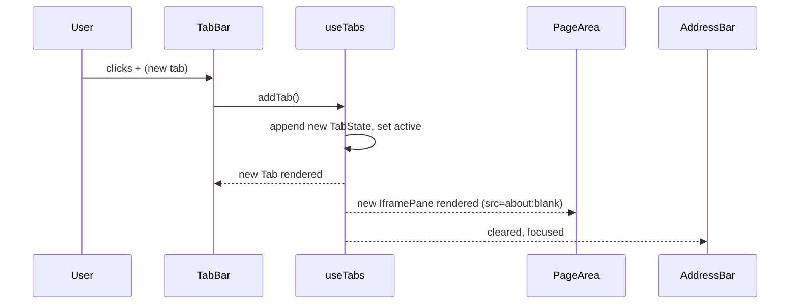
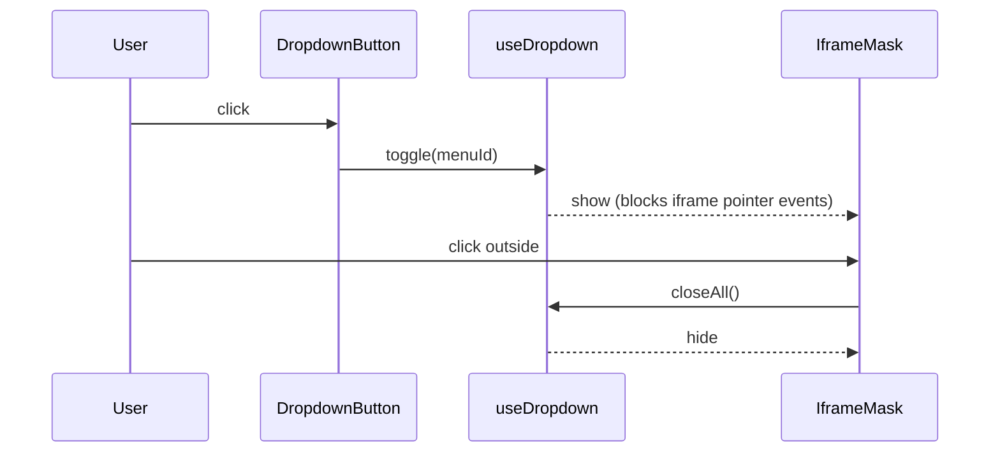

# Design Document: Next.js Browser Frontend

## Overview

Refactor the existing jQuery-based `browser.html`/`browser.js`/`browser.css` single-page browser UI into a standalone Next.js + React application located in the `frontend/` folder at the project root. The new app preserves all existing functionality — tab management, address bar navigation, bookmarks, settings menu, iframe rendering with scaling, postMessage communication, and loading indicators — while replacing imperative DOM manipulation with declarative React state and component composition.

The Next.js app is a standalone frontend that communicates with the existing Spring Boot backend via proxied HTTP requests. It is developed and built independently, with its output optionally served by the backend or a separate static host.

## Architecture



## Sequence Diagrams

### Tab Navigation Flow



### New Tab Flow



### Dropdown / IframeMask Flow



## Components and Interfaces

### BrowserApp (root page component)

**Purpose**: Root orchestrator. Owns global state via hooks, passes down props/callbacks.

**Interface**:
```typescript
// app/page.tsx or app/browser/page.tsx
export default function BrowserApp(): JSX.Element
```

**Responsibilities**:
- Instantiate `useTabs`, `useIframeMessages`, `useDropdown`
- Render `TopBar` and `PageArea`
- Wire postMessage handler to tab state updates

---

### TopBar

**Purpose**: Contains the tab bar row and the main navigation bar row.

**Interface**:
```typescript
interface TopBarProps {
  tabs: TabState[]
  activeTabId: number
  onAddTab: () => void
  onActivateTab: (id: number) => void
  onCloseTab: (id: number) => void
  onCloseOthers: () => void
  onCloseRight: () => void
  onNavigate: (url: string) => void
  onBack: () => void
  onForward: () => void
  onRefresh: () => void
  bookmarks: Bookmark[]
  openDropdown: string | null
  onToggleDropdown: (id: string) => void
  onCloseDropdowns: () => void
}
```

---

### TabBar

**Purpose**: Renders the horizontal tab strip and the opened-tabs dropdown button.

**Interface**:
```typescript
interface TabBarProps {
  tabs: TabState[]
  activeTabId: number
  onAddTab: () => void
  onActivateTab: (id: number) => void
  onCloseTab: (id: number) => void
  openDropdown: string | null
  onToggleDropdown: (id: string) => void
}
```

---

### Tab

**Purpose**: Single tab chip with icon, title, loading indicator, and close button.

**Interface**:
```typescript
interface TabProps {
  tab: TabState
  isActive: boolean
  onActivate: () => void
  onClose: (e: React.MouseEvent) => void
}
```

---

### MainBar

**Purpose**: Navigation buttons + address bar + bookmarks + settings.

**Interface**:
```typescript
interface MainBarProps {
  activeTab: TabState | undefined
  onNavigate: (url: string) => void
  onBack: () => void
  onForward: () => void
  onRefresh: () => void
  onAddTab: () => void
  onCloseTab: () => void
  onCloseOthers: () => void
  onCloseRight: () => void
  bookmarks: Bookmark[]
  openDropdown: string | null
  onToggleDropdown: (id: string) => void
}
```

---

### AddressBar

**Purpose**: URL input with focus/blur styling and Enter-to-navigate.

**Interface**:
```typescript
interface AddressBarProps {
  url: string
  onNavigate: (url: string) => void
}
```

---

### NavButtons

**Purpose**: Back, Forward, Refresh icon buttons.

**Interface**:
```typescript
interface NavButtonsProps {
  canGoBack: boolean
  canGoForward: boolean
  onBack: () => void
  onForward: () => void
  onRefresh: () => void
}
```

---

### BookmarksMenu / SettingsMenu / OpenedTabsMenu

**Purpose**: Dropdown menus for bookmarks, settings actions, and open tab list.

**Interface** (shared pattern):
```typescript
interface DropdownMenuProps {
  isOpen: boolean
  onClose: () => void
}

interface BookmarksMenuProps extends DropdownMenuProps {
  bookmarks: Bookmark[]
  onNavigate: (url: string) => void
}

interface SettingsMenuProps extends DropdownMenuProps {
  onAddTab: () => void
  onCloseTab: () => void
  onCloseOthers: () => void
  onCloseRight: () => void
}

interface OpenedTabsMenuProps extends DropdownMenuProps {
  tabs: TabState[]
  activeTabId: number
  onActivate: (id: number) => void
  onClose: (id: number) => void
}
```

---

### PageArea

**Purpose**: Container for all iframe panes and the iframe mask overlay.

**Interface**:
```typescript
interface PageAreaProps {
  tabs: TabState[]
  activeTabId: number
  iframeMaskVisible: boolean
  onMaskClick: () => void
  iframeRefs: React.MutableRefObject<Record<number, HTMLIFrameElement | null>>
}
```

---

### IframePane

**Purpose**: Single iframe element, visible only when its tab is active. Applies CSS scale transform for non-responsive pages.

**Interface**:
```typescript
interface IframePaneProps {
  tab: TabState
  isActive: boolean
  iframeRef: React.RefCallback<HTMLIFrameElement>
}
```

## Data Models

### TabState

```typescript
interface TabState {
  id: number
  url: string          // current proxied or blank URL
  displayUrl: string   // original remote URL shown in address bar
  title: string
  icon: string         // favicon URL or fallback 'logo.svg'
  loading: boolean
  canGoBack: boolean
  canGoForward: boolean
  viewportWidth?: number  // reported by interceptor for scaling
}
```

### Bookmark

```typescript
interface Bookmark {
  label: string
  url: string
  external?: boolean  // opens in new browser tab
}
```

### IframeMessage (inbound from interceptor.js)

```typescript
type IframeMessage =
  | { action: 'load';   url: string; title: string; icon?: string; width?: number }
  | { action: 'unload' }
  | { action: 'open';   url: string }
  | { action: 'scroll'; scrollTop: number }
```

### OutboundIframeMessage (sent to iframe)

```typescript
type OutboundIframeMessage =
  | { action: 'back' }
  | { action: 'forward' }
```

## Key Functions with Formal Specifications

### buildProxyUrl

```typescript
function buildProxyUrl(url: string): string
```

**Preconditions:**
- `url` is a non-empty string

**Postconditions:**
- If `url` already contains `window.location.host`, returns `url` unchanged
- If `url` does not contain `//`, prepends `https://` then proxies
- Otherwise returns `"?url=" + encodeURIComponent(url)`
- Never returns an empty string

---

### useTabs hook

```typescript
function useTabs(): {
  tabs: TabState[]
  activeTabId: number
  activeTab: TabState | undefined
  addTab: (url?: string) => void
  closeTab: (id: number) => void
  activateTab: (id: number) => void
  navigate: (id: number, url: string) => void
  updateTab: (id: number, patch: Partial<TabState>) => void
  closeOthers: () => void
  closeRight: () => void
}
```

**Preconditions:**
- Hook is called at the top level of a React component

**Postconditions (invariants):**
- `tabs.length >= 1` at all times (closing the last tab opens a new blank tab)
- `activeTabId` always refers to an id present in `tabs`
- After `addTab()`, the new tab is active and `tabs.length` increases by 1
- After `closeTab(id)` where `id === activeTabId`, the nearest sibling tab becomes active
- After `navigate(id, url)`, `tabs[id].loading === true` and `tabs[id].url === buildProxyUrl(url)`

---

### useIframeMessages hook

```typescript
function useIframeMessages(
  iframeRefs: React.MutableRefObject<Record<number, HTMLIFrameElement | null>>,
  onMessage: (tabId: number, msg: IframeMessage) => void
): void
```

**Preconditions:**
- `iframeRefs` contains current iframe DOM references keyed by tab id
- `onMessage` is a stable callback (wrapped in `useCallback`)

**Postconditions:**
- Registers a single `window.addEventListener('message', ...)` on mount
- Removes the listener on unmount
- Correctly maps `event.source` to a tab id by iterating `iframeRefs`
- Calls `onMessage` only when source matches a known iframe

---

### useDropdown hook

```typescript
function useDropdown(): {
  openDropdown: string | null
  toggle: (id: string) => void
  closeAll: () => void
}
```

**Postconditions:**
- At most one dropdown is open at a time
- `toggle(id)` closes the currently open dropdown if `id` differs, then opens `id`
- `closeAll()` sets `openDropdown` to `null`

---

### scaleIframe

```typescript
function scaleIframe(
  iframe: HTMLIFrameElement,
  containerWidth: number,
  reportedWidth: number | undefined
): void
```

**Preconditions:**
- `iframe` is a mounted DOM element
- `containerWidth > 0`

**Postconditions:**
- If `reportedWidth` is defined and `containerWidth < reportedWidth`:
  - Applies `transform: scale(scale, scale)` with `transform-origin: top left`
  - Sets `iframe.style.width = reportedWidth + 'px'`
  - Sets `iframe.style.height = floor(containerHeight / scale) + 'px'`
- Otherwise clears all inline transform/size styles

## Algorithmic Pseudocode

### Main Message Handler Algorithm

```pascal
PROCEDURE handleIframeMessage(event, iframeRefs, tabs, dispatch)
  INPUT: event (MessageEvent), iframeRefs, tabs, dispatch
  OUTPUT: side effects on tab state

  tabId ← findTabIdBySource(event.source, iframeRefs)
  IF tabId = null THEN RETURN END IF

  CASE event.data.action OF
    'load':
      page ← {url: event.data.url, title: event.data.title,
               icon: event.data.icon OR 'logo.svg',
               loading: false, viewportWidth: event.data.width}
      dispatch(updateTab(tabId, page))

    'unload':
      dispatch(updateTab(tabId, {loading: true}))

    'open':
      dispatch(addTab(event.data.url))

    'scroll':
      // reserved for future scroll-hide top bar behaviour
      NOOP
  END CASE
END PROCEDURE
```

**Loop Invariants**: N/A (no loops)

---

### Tab Close Algorithm

```pascal
PROCEDURE closeTab(id, tabs, activeTabId)
  INPUT: id (tab id to close), tabs (TabState[]), activeTabId
  OUTPUT: nextTabs (TabState[]), nextActiveId

  nextTabs ← tabs.filter(t => t.id ≠ id)

  IF nextTabs.length = 0 THEN
    nextTabs ← [newBlankTab()]
    nextActiveId ← nextTabs[0].id
    RETURN (nextTabs, nextActiveId)
  END IF

  IF id = activeTabId THEN
    idx ← tabs.findIndex(t => t.id = id)
    // prefer next sibling, fall back to previous
    IF idx < nextTabs.length THEN
      nextActiveId ← nextTabs[idx].id
    ELSE
      nextActiveId ← nextTabs[nextTabs.length - 1].id
    END IF
  ELSE
    nextActiveId ← activeTabId
  END IF

  RETURN (nextTabs, nextActiveId)
END PROCEDURE
```

**Loop Invariants**: N/A

---

### Iframe Scale Algorithm

```pascal
PROCEDURE scaleIframe(iframe, containerWidth, reportedWidth)
  INPUT: iframe (HTMLIFrameElement), containerWidth (px), reportedWidth (px | undefined)

  IF reportedWidth IS DEFINED AND containerWidth < reportedWidth THEN
    scale ← containerWidth / reportedWidth
    containerHeight ← iframe.parentElement.clientHeight
    iframe.style.transformOrigin ← 'top left'
    iframe.style.transform ← 'scale(' + scale + ', ' + scale + ')'
    iframe.style.width ← reportedWidth + 'px'
    iframe.style.height ← floor(containerHeight / scale) + 'px'
  ELSE
    iframe.style.transformOrigin ← ''
    iframe.style.transform ← ''
    iframe.style.width ← ''
    iframe.style.height ← ''
  END IF
END PROCEDURE
```

## Example Usage

```typescript
// Root page wiring example
export default function BrowserApp() {
  const { tabs, activeTabId, activeTab, addTab, closeTab,
          activateTab, navigate, updateTab, closeOthers, closeRight } = useTabs()
  const { openDropdown, toggle, closeAll } = useDropdown()
  const iframeRefs = useRef<Record<number, HTMLIFrameElement | null>>({})

  const handleMessage = useCallback((tabId: number, msg: IframeMessage) => {
    if (msg.action === 'load') {
      updateTab(tabId, { url: msg.url, title: msg.title,
                         icon: msg.icon ?? 'logo.svg',
                         loading: false, viewportWidth: msg.width })
    } else if (msg.action === 'unload') {
      updateTab(tabId, { loading: true })
    } else if (msg.action === 'open') {
      addTab(msg.url)
    }
  }, [updateTab, addTab])

  useIframeMessages(iframeRefs, handleMessage)

  return (
    <div id="browser">
      <TopBar
        tabs={tabs} activeTabId={activeTabId}
        onAddTab={addTab} onActivateTab={activateTab} onCloseTab={closeTab}
        onCloseOthers={closeOthers} onCloseRight={closeRight}
        onNavigate={(url) => navigate(activeTabId, url)}
        onBack={() => { /* postMessage back */ }}
        onForward={() => { /* postMessage forward */ }}
        onRefresh={() => activeTab && navigate(activeTabId, activeTab.displayUrl)}
        bookmarks={DEFAULT_BOOKMARKS}
        openDropdown={openDropdown}
        onToggleDropdown={toggle}
        onCloseDropdowns={closeAll}
      />
      <PageArea
        tabs={tabs} activeTabId={activeTabId}
        iframeMaskVisible={openDropdown !== null}
        onMaskClick={closeAll}
        iframeRefs={iframeRefs}
      />
    </div>
  )
}
```

## Correctness Properties

*A property is a characteristic or behavior that should hold true across all valid executions of a system — essentially, a formal statement about what the system should do. Properties serve as the bridge between human-readable specifications and machine-verifiable correctness guarantees.*

### Property 1: Tab count invariant

*For any* sequence of `addTab`, `closeTab`, `closeOthers`, and `closeRight` operations, `tabs.length` must always be greater than or equal to 1. Closing the last tab must produce a new blank tab before the closed tab is removed.

**Validates: Requirements 2.1, 2.5, 12.4**

---

### Property 2: Active tab id validity

*For any* sequence of tab operations, `activeTabId` must always refer to an id that exists in the current `tabs` array.

**Validates: Requirements 2.2**

---

### Property 3: addTab grows the list and activates the new tab

*For any* tab state, calling `addTab()` must increase `tabs.length` by exactly 1 and set `activeTabId` to the newly created tab's id.

**Validates: Requirements 2.3**

---

### Property 4: closeTab activates nearest sibling

*For any* tab array and any `activeTabId`, calling `closeTab(activeTabId)` must set `activeTabId` to the next sibling's id if one exists, otherwise to the previous sibling's id.

**Validates: Requirements 2.4**

---

### Property 5: closeOthers leaves only the active tab

*For any* tab array with any `activeTabId`, calling `closeOthers()` must result in `tabs.length === 1` and the remaining tab must be the previously active tab.

**Validates: Requirements 2.7**

---

### Property 6: closeRight removes only right-side tabs

*For any* tab array and any `activeTabId`, calling `closeRight()` must remove all tabs positioned after the active tab in the array and leave all tabs at or before the active tab unchanged.

**Validates: Requirements 2.8**

---

### Property 7: navigate sets loading and proxied URL immediately

*For any* tab id and any non-empty URL string, calling `navigate(id, url)` must immediately set `tabs[id].loading` to `true` and `tabs[id].url` to `buildProxyUrl(url)`.

**Validates: Requirements 3.2, 9.3**

---

### Property 8: buildProxyUrl never returns empty string

*For any* non-empty input string, `buildProxyUrl` must return a non-empty string.

**Validates: Requirements 3.3**

---

### Property 9: buildProxyUrl passthrough for same-host URLs

*For any* URL string that contains `window.location.host`, `buildProxyUrl` must return the URL unchanged.

**Validates: Requirements 3.4**

---

### Property 10: buildProxyUrl prepends https:// for protocol-less inputs

*For any* string that does not contain `//`, `buildProxyUrl` must prepend `https://` before constructing the proxied URL.

**Validates: Requirements 3.5, 12.2**

---

### Property 11: buildProxyUrl wraps external URLs with ?url=

*For any* URL string that contains `//` and does not contain `window.location.host`, `buildProxyUrl` must return `"?url=" + encodeURIComponent(url)`.

**Validates: Requirements 3.6**

---

### Property 12: Nav buttons disabled state matches tab history flags

*For any* TabState where `canGoBack` is `false`, the back button must be rendered disabled; *for any* TabState where `canGoForward` is `false`, the forward button must be rendered disabled.

**Validates: Requirements 4.4, 4.5**

---

### Property 13: Inactive iframes use visibility:hidden

*For any* set of tabs, every IframePane whose tab id does not equal `activeTabId` must have `visibility: hidden` applied, not `display: none`.

**Validates: Requirements 5.2**

---

### Property 14: postMessage routing matches source to correct tab

*For any* set of iframes registered in `iframeRefs` and any inbound message event, `useIframeMessages` must identify the tab id by matching `event.source` against the iframe content windows and invoke `onMessage` with that tab id.

**Validates: Requirements 6.2**

---

### Property 15: Unknown postMessage sources are silently ignored

*For any* message event whose source is not present in `iframeRefs`, `useIframeMessages` must not modify any tab state and must not throw an error.

**Validates: Requirements 6.3, 12.3**

---

### Property 16: load message updates tab fields correctly

*For any* `{ action: 'load', url, title, icon, width }` message received from a known iframe, `updateTab` must be called with `{ url, title, icon: icon ?? 'logo.svg', loading: false, viewportWidth: width }`.

**Validates: Requirements 6.4, 9.4**

---

### Property 17: unload message sets tab loading to true

*For any* `{ action: 'unload' }` message received from a known iframe, `updateTab` must be called with `{ loading: true }` for that tab.

**Validates: Requirements 6.5**

---

### Property 18: open message triggers addTab with the given URL

*For any* `{ action: 'open', url }` message received from a known iframe, `addTab(url)` must be called with the provided URL.

**Validates: Requirements 6.6**

---

### Property 19: scaleIframe applies correct transform when container is narrower

*For any* `containerWidth` and `reportedWidth` where `containerWidth < reportedWidth`, `scaleIframe` must apply `transform: scale(scale, scale)` with `transform-origin: top left`, set `iframe.style.width` to `reportedWidth + 'px'`, and set `iframe.style.height` to `floor(containerHeight / scale) + 'px'`, where `scale = containerWidth / reportedWidth`.

**Validates: Requirements 7.1, 7.2**

---

### Property 20: scaleIframe clears styles when scaling is not needed

*For any* call to `scaleIframe` where `containerWidth >= reportedWidth` or `reportedWidth` is `undefined`, all inline transform and size styles must be cleared from the iframe element.

**Validates: Requirements 7.3, 7.4**

---

### Property 21: At most one dropdown open at a time

*For any* sequence of `toggle` calls, `openDropdown` must hold at most one id at any point in time.

**Validates: Requirements 8.1**

---

### Property 22: toggle closes an already-open dropdown

*For any* dropdown id that is currently open, calling `toggle(id)` again must set `openDropdown` to `null`.

**Validates: Requirements 8.3**

---

### Property 23: closeAll sets openDropdown to null

*For any* dropdown state, calling `closeAll()` must result in `openDropdown === null`.

**Validates: Requirements 8.4**

---

### Property 24: IframeMask is visible when a dropdown is open

*For any* state where `openDropdown` is not `null`, the IframeMask overlay must be rendered and visible in the PageArea.

**Validates: Requirements 8.5**

---

### Property 25: OpenedTabsMenu renders one entry per open tab

*For any* tab array, the OpenedTabsMenu must render exactly `tabs.length` entries.

**Validates: Requirements 8.9**

---

### Property 26: Loading spinner visibility matches tab.loading

*For any* TabState, the Tab component must display the loading spinner and hide the favicon when `tab.loading === true`, and display the favicon and hide the spinner when `tab.loading === false`.

**Validates: Requirements 9.1, 9.2**

## Folder Structure

```
frontend/
├── app/
│   ├── layout.tsx          # root layout, global CSS import
│   ├── page.tsx            # BrowserApp root component
│   └── globals.css         # ported + adapted browser.css
├── components/
│   ├── TopBar.tsx
│   ├── TabBar.tsx
│   ├── Tab.tsx
│   ├── MainBar.tsx
│   ├── AddressBar.tsx
│   ├── NavButtons.tsx
│   ├── BookmarksMenu.tsx
│   ├── SettingsMenu.tsx
│   ├── OpenedTabsMenu.tsx
│   ├── PageArea.tsx
│   └── IframePane.tsx
├── hooks/
│   ├── useTabs.ts
│   ├── useDropdown.ts
│   └── useIframeMessages.ts
├── lib/
│   └── url.ts              # buildProxyUrl, isWrapped helpers
├── types/
│   └── browser.ts          # TabState, Bookmark, IframeMessage types
├── public/
│   ├── logo.svg
│   ├── loading.svg
│   ├── favicon.png
│   └── interceptor.js      # copied from static/, served as-is
├── next.config.ts           # rewrites: /api/* → Spring Boot backend
├── package.json
└── tsconfig.json
```

## Error Handling

### Iframe Load Failure
**Condition**: The proxied URL returns an error or the iframe fails to load.
**Response**: The `'load'` postMessage may not arrive; the loading spinner stays visible.
**Recovery**: A timeout (e.g. 30s) in `useIframeMessages` clears the loading state and sets a generic error title. The user can refresh or navigate away.

### Invalid URL Input
**Condition**: User enters a non-URL string in the address bar.
**Response**: `buildProxyUrl` prepends `https://` and proxies; the backend or remote server returns an error page inside the iframe.
**Recovery**: No special handling needed — the iframe displays the error page naturally.

### Last Tab Closed
**Condition**: User closes the only remaining tab.
**Response**: `closeTab` detects `tabs.length === 1` and immediately calls `addTab()` to open a blank tab.
**Recovery**: Automatic — user always has at least one tab.

### postMessage from Unknown Source
**Condition**: A `message` event arrives from a window not in `iframeRefs`.
**Response**: `useIframeMessages` finds no matching tab id and silently ignores the event.
**Recovery**: No action needed.

## Testing Strategy

### Unit Testing Approach

Test pure logic in isolation using Jest + React Testing Library:
- `useTabs`: verify invariants (min 1 tab, active id always valid, loading state transitions)
- `buildProxyUrl`: verify URL wrapping, https prepend, passthrough for same-host URLs
- `closeTab` reducer logic: verify sibling selection, last-tab auto-open
- `useDropdown`: verify at-most-one-open invariant

### Property-Based Testing Approach

**Property Test Library**: fast-check

Key properties to test:
- `buildProxyUrl` never returns empty string for any non-empty input
- After any sequence of `addTab`/`closeTab` operations, `tabs.length >= 1`
- After any sequence of tab operations, `activeTabId` is always present in `tabs`
- `scaleIframe` never applies negative or zero scale values

### Integration Testing Approach

- Render `BrowserApp` in a jsdom environment and simulate user interactions (add tab, type URL, close tab) to verify end-to-end state transitions
- Mock `window.postMessage` to simulate interceptor messages and verify tab title/icon/loading updates

## Performance Considerations

- Iframes are never unmounted — only hidden via CSS `visibility: hidden` — to preserve page state across tab switches, matching the original behaviour
- `useCallback` and `useMemo` used for message handlers and tab lookups to avoid unnecessary re-renders
- Tab state updates are batched where possible (React 18 automatic batching)
- The `scaleIframe` function is called only on `'load'` messages, not on every render

## Security Considerations

- Iframes use `sandbox="allow-scripts allow-same-origin allow-downloads allow-forms"` matching the original, preventing top-level navigation from within iframes
- `postMessage` handlers validate `event.source` against known iframe refs before processing
- `buildProxyUrl` routes all external URLs through the Spring Boot proxy, preventing direct cross-origin requests from the browser
- `interceptor.js` is served as a static asset and injected by the backend; the frontend does not modify it

## Dependencies

- `next` (v14+) — framework
- `react` / `react-dom` (v18+) — UI
- `typescript` — type safety
- `tailwindcss` (optional) — utility CSS, or plain CSS modules porting `browser.css`
- `fast-check` (dev) — property-based testing
- `jest` + `@testing-library/react` (dev) — unit/integration tests
- Spring Boot backend — proxy endpoint at `/?url=...`, asset serving for `interceptor.js`
